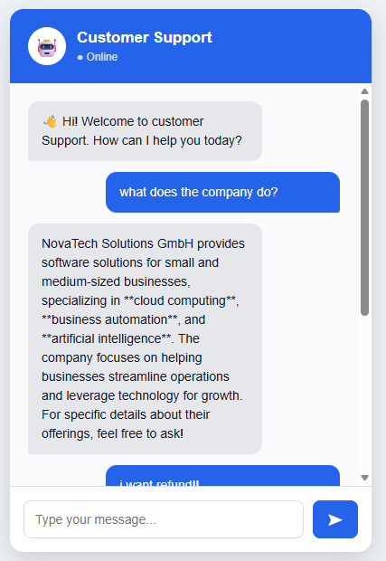

# 🤖 Company Customer Support Agent

An AI-powered, customizable customer support agent built with **LangGraph, LangChain, Ollama, FAISS, RAG, FastAPI, and HTML/CSS/JavaScript**.

The main idea is simple:

> **Add your company's support information to the `docs/` folder, start the application, and the AI agent uses that information to answer customer questions.**

You can use this project for your own company, product, SaaS application, internal support system, or personal AI-agent experiments.

---

## ✨ Features

* 🤖 Local LLM using **Ollama**
* 🧠 Qwen3 for response generation
* 📚 Custom company knowledge base
* 🔎 Retrieval-Augmented Generation (RAG)
* 🧩 FAISS vector similarity search
* 🔤 Ollama embeddings with `nomic-embed-text`
* 🔄 LangGraph agent workflow
* 🚨 Automatic escalation detection
* 💬 Conversation history
* ⚡ FastAPI backend
* 🌐 Simple browser-based chat UI
* 📖 Swagger API documentation
* 🔒 Local AI inference
* 🏢 **Easy company-specific customization**

---

# 🎯 How It Works

The project is designed so that you don't need to modify the AI logic every time you want to use it for a different company.

Simply update the documents inside:

```text
docs/
```

For example:

```text
docs/
├── company_info.md
├── products.md
├── pricing.md
├── troubleshooting.md
├── billing.md
├── refund_policy.md
└── faq.md
```

The application automatically loads these documents and creates a searchable knowledge base.

### Architecture

```text
                  ┌───────────────────────┐
                  │       Customer        │
                  └───────────┬───────────┘
                              │
                              ▼
                  ┌───────────────────────┐
                  │      Chat UI          │
                  │   HTML/CSS/JS         │
                  └───────────┬───────────┘
                              │
                              ▼
                  ┌───────────────────────┐
                  │       FastAPI         │
                  │       /chat           │
                  └───────────┬───────────┘
                              │
                              ▼
                  ┌───────────────────────┐
                  │      LangGraph        │
                  │    Agent Workflow     │
                  └───────────┬───────────┘
                              │
                ┌─────────────┴─────────────┐
                │                           │
                ▼                           ▼
       ┌────────────────┐          ┌─────────────────┐
       │ RAG Retrieval  │          │ Escalation Check│
       └───────┬────────┘          └─────────────────┘
               │
               ▼
       ┌────────────────┐
       │      FAISS     │
       │ Vector Search  │
       └───────┬────────┘
               │
               ▼
       ┌────────────────┐
       │ Ollama         │
       │ Embeddings     │
       │ nomic-embed    │
       └───────┬────────┘
               │
               ▼
       ┌────────────────┐
       │ Ollama         │
       │ Qwen3:8b       │
       └───────┬────────┘
               │
               ▼
       ┌────────────────┐
       │ AI Response    │
       └────────────────┘
```

---

# 🏢 Make It Your Own

This is the main feature of the project.

You can turn the agent into a support bot for **any company** by changing the knowledge-base documents.

You do **not** need to change the RAG implementation.

You do **not** need to retrain the LLM.

You simply provide your company's information in `docs/`.

---

## 📁 Example Company Knowledge Base

Suppose you own a company called:

```text
Acme Cloud
```

You could create:

```text
docs/
├── company.md
├── products.md
├── pricing.md
├── support.md
├── refund_policy.md
└── faq.md
```

### `company.md`

```markdown
# Acme Cloud

Acme Cloud provides cloud storage and file synchronization
services for individuals and businesses.

Website:
https://example.com

Customer support:
support@example.com
```

### `products.md`

```markdown
# Products

## Acme Drive

Acme Drive provides secure cloud file storage.

Storage plans:

- Free: 5 GB
- Pro: 100 GB
- Business: 1 TB
```

### `refund_policy.md`

```markdown
# Refund Policy

Customers can request a refund within 30 days of purchase.

Refund requests should be submitted through customer support.
```

The agent will use these documents when answering customer questions.

---

# 🧠 RAG Pipeline

When a customer asks:

```text
How much storage does the Pro plan provide?
```

the system performs the following:

```text
Customer Question
       │
       ▼
Create Embedding
       │
       ▼
FAISS Similarity Search
       │
       ▼
Find Relevant Documents
       │
       ▼
Retrieve Top 3 Chunks
       │
       ▼
Send Context + Question
       │
       ▼
Qwen3
       │
       ▼
Customer Answer
```

This allows the LLM to answer using your company's actual documentation rather than relying only on its pretrained knowledge.

---

# 🚨 Escalation

The agent also contains an escalation mechanism for potentially sensitive customer-support issues.

Examples include:

```text
refund
lawsuit
fraud
billing error
data loss
cancel account
charge
broken
```

For example:

```text
I was charged twice and want a refund.
```

can trigger an escalation.

The API response includes:

```json
{
  "response": "Your request has been escalated...",
  "escalated": true
}
```

Normal questions return:

```json
{
  "response": "Here is the information...",
  "escalated": false
}
```

> The escalation keywords can be customized in `agent.py`.

---

# 🛠️ Technology Stack

| Technology          | Purpose                 |
| ------------------- | ----------------------- |
| Python              | Core application        |
| LangGraph           | Agent orchestration     |
| LangChain           | LLM and RAG integration |
| Ollama              | Local AI inference      |
| Qwen3:8b            | Chat model              |
| nomic-embed-text    | Embeddings              |
| FAISS               | Vector search           |
| FastAPI             | Backend API             |
| Uvicorn             | API server              |
| Pydantic            | Request validation      |
| HTML/CSS/JavaScript | Web UI                  |

---

# 📂 Project Structure

```text
Company_customer_support_agent/
│
├── agent.py
│
├── api.py
│
├── docs/
│   ├── company_info.md
│   ├── troubleshooting.md
│   └── ...
│
├── frontend/
│   ├── index.html
│   └── script.js
│
├── requirements.txt
├── .gitignore
└── README.md
```

---

# ⚙️ Requirements

Before running the project, install:

* Python 3.10+
* Ollama
* Git
* pip or uv

---

# 🦙 Install Ollama

Install Ollama from:

[Ollama](https://ollama.com/?utm_source=chatgpt.com)

Verify the installation:

```bash
ollama --version
```

---

# 📥 Download AI Models

Pull the chat model:

```bash
ollama pull qwen3:8b
```

Pull the embedding model:

```bash
ollama pull nomic-embed-text
```

Check installed models:

```bash
ollama list
```

You should see:

```text
qwen3:8b
nomic-embed-text
```

---

# 🚀 Installation

Clone the repository:

```bash
git clone https://github.com/Varsha-jaydev/Company_customer_support_agent.git
```

Enter the project:

```bash
cd Company_customer_support_agent
```

Create a virtual environment:

```bash
python -m venv .venv
```

Activate it on Windows:

```powershell
.venv\Scripts\activate
```

Install dependencies:

```bash
pip install -r requirements.txt
```

---

# 📝 Add Your Company Information

This is the most important step.

Go to:

```text
docs/
```

Remove the example documents if necessary and add your own `.md` or `.txt` files.

For example:

```text
docs/
├── company_info.md
├── products.md
├── pricing.md
├── support.md
├── policies.md
└── faq.md
```

You can organize your documentation however you want.

### Supported formats

The application currently reads:

```text
.md
.txt
```

Files can be nested inside subdirectories as well.

For example:

```text
docs/
├── company/
│   └── information.md
│
├── products/
│   ├── product_a.md
│   └── product_b.md
│
└── support/
    ├── faq.md
    └── troubleshooting.txt
```

---

# ▶️ Start the Application

Run:

```bash
uvicorn api:app --reload
```

You should see:

```text
Uvicorn running on http://127.0.0.1:8000
```

---

# 🌐 Open the Customer Support UI

Open:

```text
http://127.0.0.1:8000/ui/
```

You will see the customer-support chat interface.

You can then ask questions based on your company's documentation.

Example:

```text
Customer:
What products does your company offer?

Agent:
According to the company documentation, ...
```

---

# 📖 API Documentation

FastAPI automatically generates interactive API documentation.

Open:

```text
http://127.0.0.1:8000/docs
```

The main endpoint is:

```text
POST /chat
```

---

# 💬 API Example

### Request

```json
{
  "message": "What is your refund policy?",
  "history": []
}
```

### Response

```json
{
  "response": "According to the refund policy...",
  "escalated": false
}
```

---

# ❤️ Health Check

You can check whether the API is running:

```text
GET /health
```

Open:

```text
http://127.0.0.1:8000/health
```

Expected response:

```json
{
  "status": "ok"
}
```

---

# 🖥️ Screenshots

## 💬 Customer Support Chat UI

The browser-based customer support interface allows users to interact with the AI agent using natural language.



---

## 📖 FastAPI Swagger Documentation

The API provides an interactive Swagger UI for testing the `/chat` and `/health` endpoints.


---

## 🧠 RAG-Based Customer Response

The agent retrieves relevant information from the company's `docs/` knowledge base and uses it to generate a response.


---

## 🚨 Automatic Escalation

Requests containing configured escalation conditions can be automatically flagged for human support.


# ⭐ Project Goal

The goal of this project is to provide a simple starting point for building **custom AI customer-support agents using local LLMs and company-specific knowledge**.

Instead of building a completely new AI application for every company:

```text
Same AI Agent
      +
Different docs/
      =
Different Customer Support Agent
```

---

# 👩‍💻 Author

**Varsha Jaydev**

GitHub:

[Varsha Jaydev on GitHub](https://github.com/Varsha-jaydev?utm_source=chatgpt.com)

---

## ⭐ If you find this project useful

Give the repository a ⭐ on GitHub and feel free to adapt it for your own company or project.
